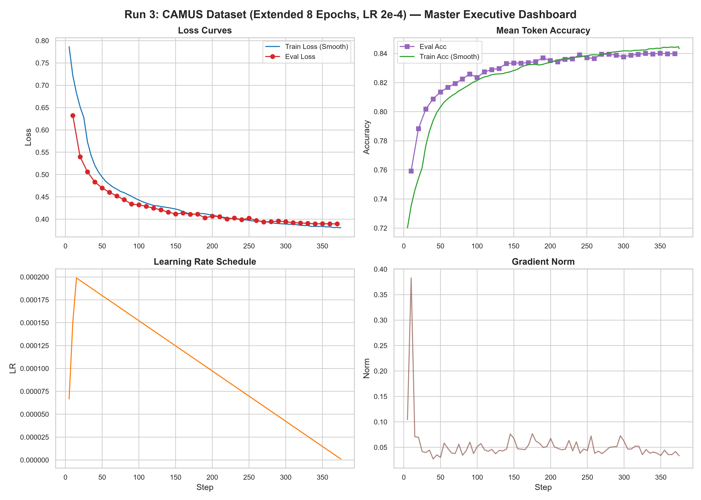
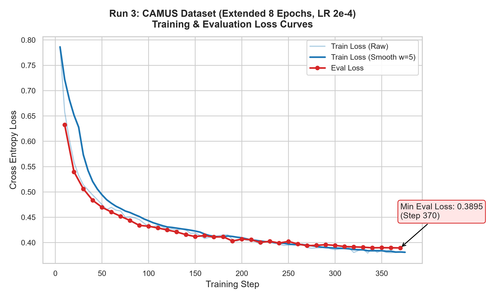
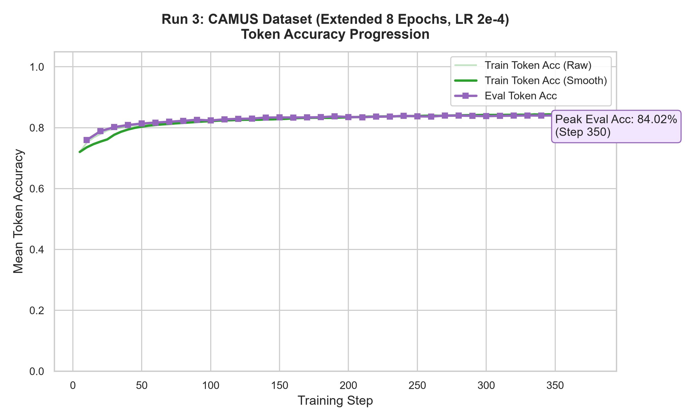
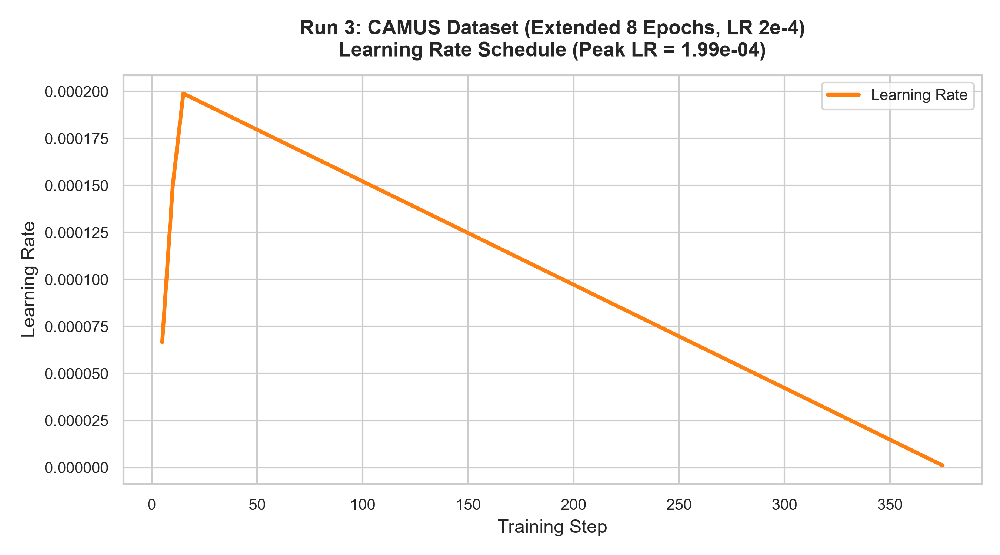
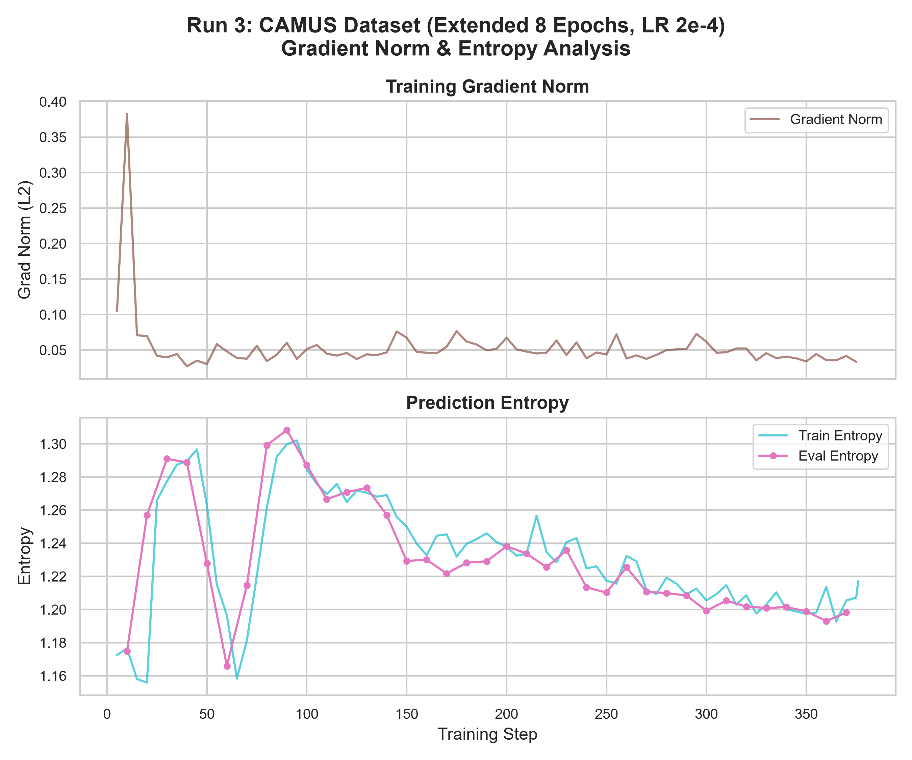
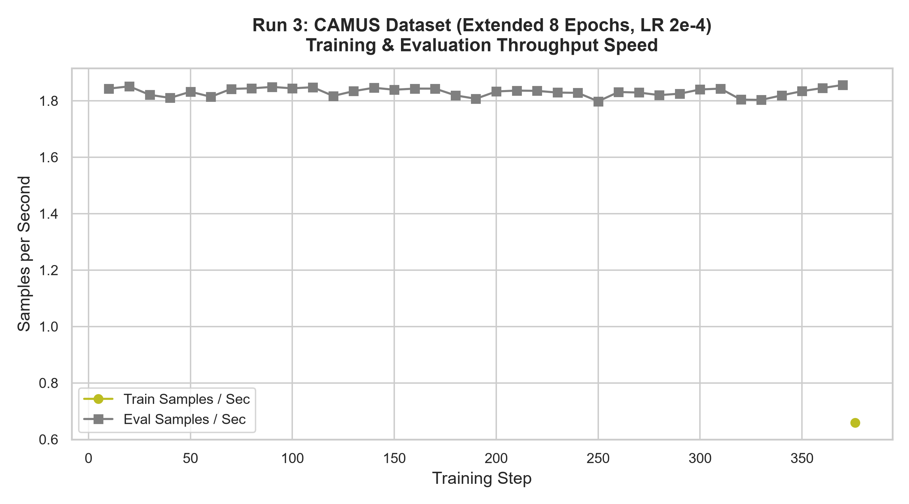

# Run 3: CAMUS Dataset (Extended 8 Epochs, LR 2e-4)
**Log Event File**: `events.out.tfevents.1771950289.0b5e3829cdda.1883.0`  
**Adapter / Output Directory**: `/content/drive/MyDrive/ATRIA-G3/output_camus`

---

## 1. Executive Summary & Overview
Aggressive finetuning on CAMUS dataset (~1,504-1,600 samples) with learning rate 2e-4 extended to 8 epochs.

| Key Performance Metric | Value |
| :--- | :---: |
| **Final Training Loss** | `0.3813` |
| **Minimum Evaluation Loss** | `0.3895` |
| **Peak Evaluation Token Accuracy** | **`84.02%`** |
| **Final Evaluation Token Accuracy** | `83.99%` |

---

## 2. Exact Hyperparameters
| Hyperparameter Parameter | Logged Value | Explanation |
| :--- | :--- | :--- |
| **Learning Rate (`learning_rate`)** | `0.0002` | Initial peak learning rate for optimizer |
| **Training Epochs (`num_train_epochs`)** | `8` | Number of passes through the training dataset |
| **Per-Device Batch Size (`per_device_train_batch_size`)** | `2` | Number of samples processed per GPU pass |
| **Gradient Accumulation Steps (`gradient_accumulation_steps`)** | `16` | Forward passes accumulated before backward step |
| **Effective Batch Size** | **`32`** | Total samples per optimizer update (`bs * ga * devices`) |
| **LR Scheduler (`lr_scheduler_type`)** | `linear` | Learning rate decay strategy |
| **Warmup Ratio (`warmup_ratio`)** | `0.03` | Fraction of steps spent warming up LR |
| **Optimizer (`optim`)** | `adamw_torch_fused` | Fused AdamW optimizer |
| **Precision (`bf16`)** | `True` | Bfloat16 mixed-precision training |
| **Max Gradient Norm (`max_grad_norm`)** | `0.3` | Gradient clipping threshold |

---

## 3. Exact Sample Size & Dataset Metrics
* **Dataset / Sample Size ($N$)**: **`1,504 unique samples`**
  * Calculated as: $\text{Total Steps} \times \text{Effective Batch Size} / \text{Epochs} = 376 \times 32 / 8 = 1,504$ samples.
* **Total Sample Exposures**: **`12,032`** training sample iterations across all epochs.
* **Total Gradient Steps Logged**: **`376`** steps.

---

## 4. Generated Performance Charts

### Master Executive Dashboard
`06_run_dashboard_summary.png` combines Loss, Token Accuracy, Learning Rate, and Gradient Norm:

### Training & Evaluation Loss Curves
`01_loss_curves.png` plots raw and smoothed training loss alongside evaluation loss:

### Token Accuracy Progression
`02_token_accuracy.png` plots evaluation and training token accuracy over steps:

### Learning Rate Schedule
`03_learning_rate_schedule.png` displays the exact linear decay learning rate schedule:

### Gradient Norm & Entropy
`04_grad_norm_and_entropy.png` illustrates gradient stability and prediction entropy:

### Throughput Performance
`05_throughput_performance.png` tracks training and evaluation speed:

